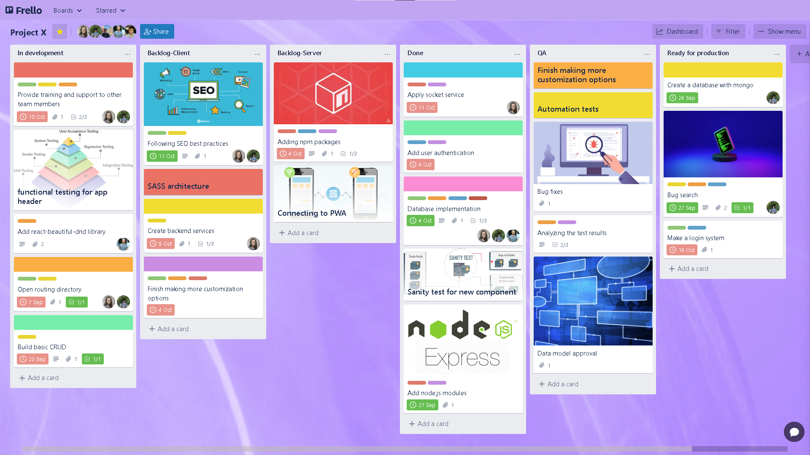
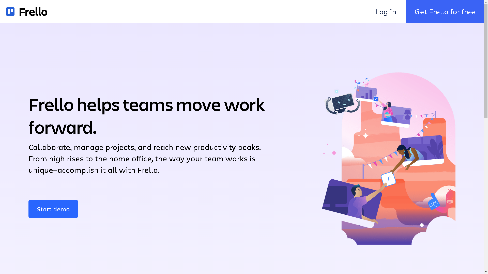
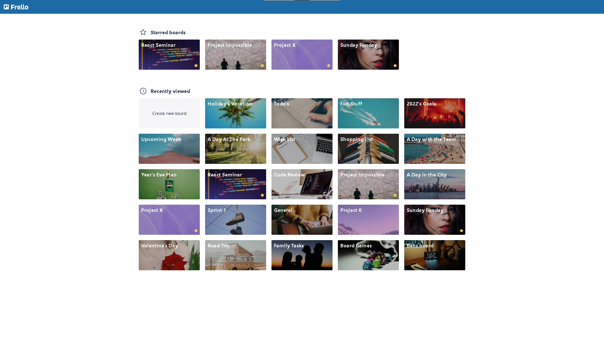
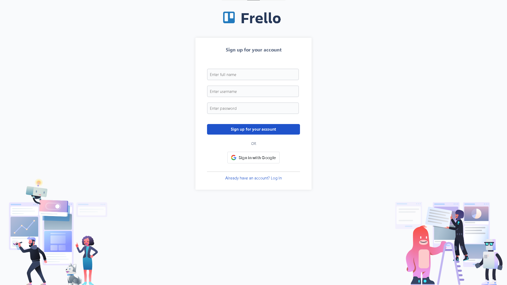
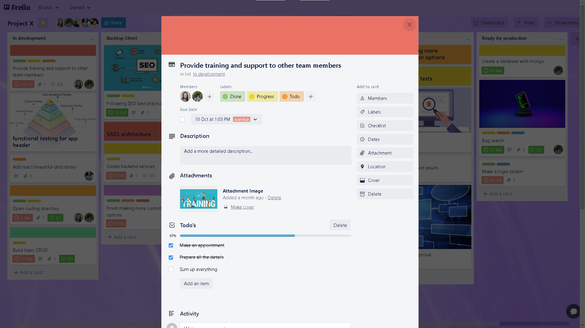
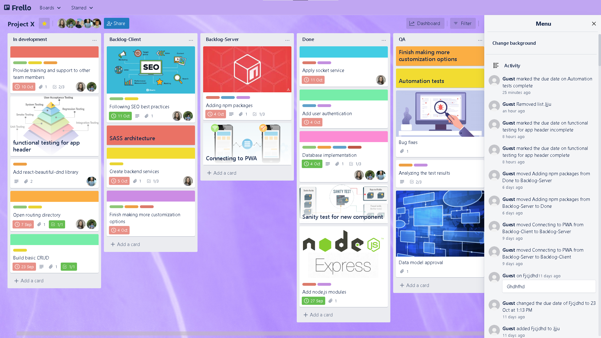
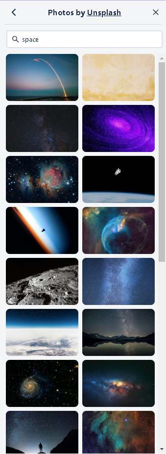
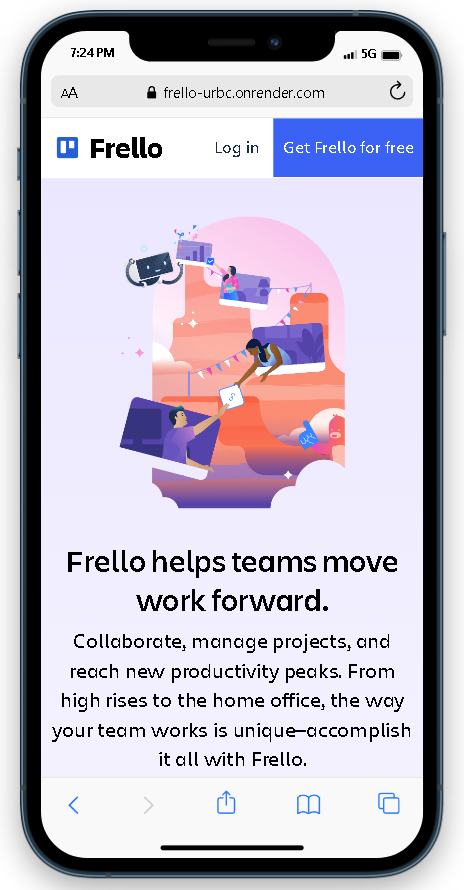
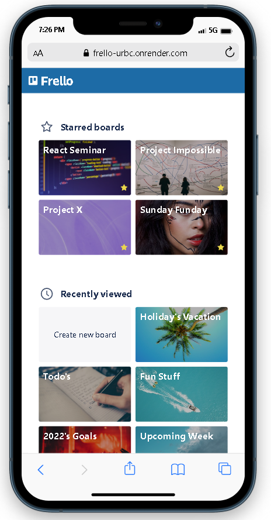

# Frello - pixel perfect, E2E clone of Trello (React + Node.js). 

Task management board app inspired by trello.com, [Here is my project link](https://frello-urbc.onrender.com/ "Frello link").



___

### Table of Contents
- [Trello Description](#trello-description)
- [Application Features](#application-features)
- [Technologies](#technologies)
- [Getting started](#getting-started)
- [Showcase](#showcase)

## Trello Description
Trello is an app in which you can manage projects and tasks using a kanban board. A board contains lists and tasks. Usually each project is a board, and the lists and cards are the tasks and subjects to do in the project. Users can modify the board and change list and card locations using Drag and Drop.
Users can work together and watch live changes. 
There are many other features in Trello, such as labels, due date for tasks, members and more. 

## Application Features
- Create ***Boards*** and manage projects: Using ***D&D***, create, remove, and update lists and tasks.
- Create, edit and delete ***Tasks*** to the deepest level: Labels, Due date, Members, Cover images, Checklists, Locations, Attachments, Activity log, Comments, Move and Delete.
- ***filtering*** - Filter tasks based on title, members assigned to the task and labels.
- ***Side Menu:*** - Change the background of the board with the ***Unsplash Photo API*** and a full board ***Activity*** Log!
- Google Login, along with regular authentication which is encrypted and safe.
 
We spent a lot of effort on making sure that the app is as close as possible to the original trello both in design and in functionality.

## Technologies

The technology stack we used was MERN - MongoDB, Express, React, Node.js.
The app uses webSockets to update the board in real-time.
The API calls to the backend are done with the REST API method.

We have used many third side libraries for many goals, such as google-login, D&D, Unsplash and more.
The layout and pixel-perfect were made with Sass (functions, mixins, variables). 

## Getting started

Head to the repositories 'frello-frontend' and 'frello-backend' in my profile and clone the project or download the files.

```
git clone https://github.com/YasminGd/frello-frontend.git
```

```
git clone https://github.com/YasminGd/frello-backend.git
```

Enter the backend part of the project and make sure you have node_modules installed. After that we will initiate the server with 'npm start':

```
npm i 
npm start
```

You shuold get a console output that the server is up and running at port 3030.
Enter the frontend section of the project and repeat the same process.

```
npm i 
npm start
```

You shuold get a console output that that the server is up and running at localhost:3000.

That's it! The App should open automatically, enjoy!

## Showcase

### Homepage
The landing page in which the user can sign up / login, or press the call to action button to start a demo with no need for registration.



### Workspace
All of the user's boards. Here the user can create new boards and visit already existing ones.



### Board
All the functionality that you have in Trello. D&D, live-updates, editing tasks to the deepest level, side-menu, editing board members and much more - just [check it out...!](https://frello-urbc.onrender.com/ "Frello link")


### Signup
We created a sign up system that uses ***Google Login***.



### Task details
Here the user can edit their tasks and watch it happens live, on this page and behind it, on the board. Every button on the right menu opens a dynamic modal which fits the content accordingly to the pressed button.




### Side menu
The menu on the right which is opened by the pressing the "Show menu" button enables the user to change the board's background with unsplash Images and watch the activities of the board (who did what and when).

<p align="center">
  
&nbsp; &nbsp; &nbsp; &nbsp;
  
</p>

<!--  -->

### Some mobile!
Just a taste of the mobile experience. We used different **mixins**, **conditional rendering**, and the **"mobile first"** approach. 

<p align="center">


</p>

<!-- 
 -->

### Authors
 - [Yasmin Gudha](https://github.com/YasminGd)
 - [Bar Ohayon](https://github.com/OhayoNB)
 - [Lee Sharon](https://github.com/leesharon)
